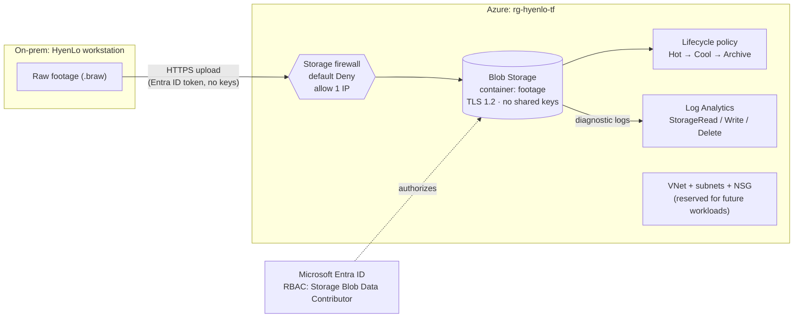
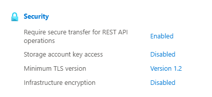
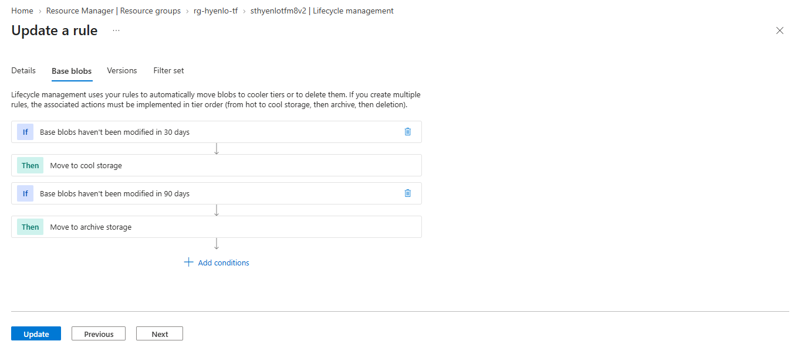
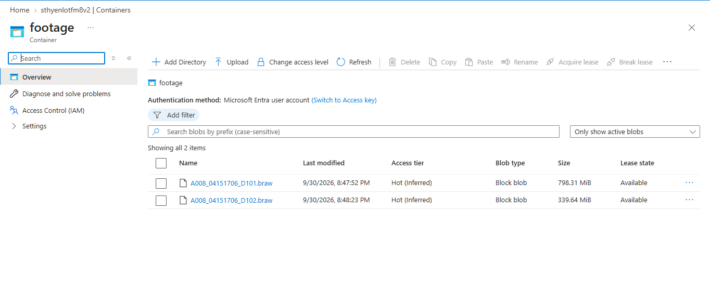
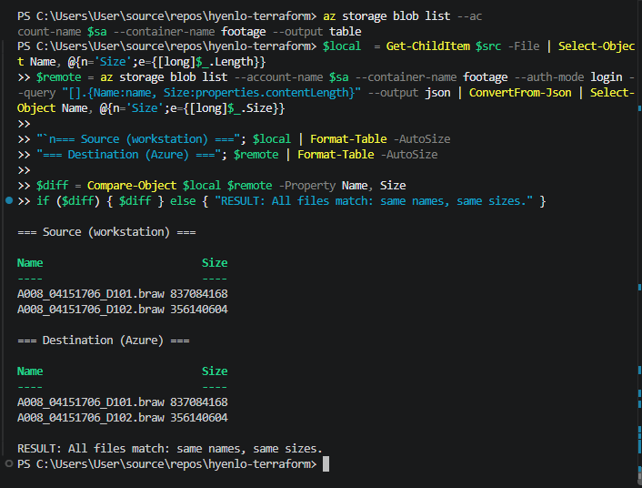

# Secure Media Migration to Azure

Migrating a small video production company's raw footage from a local workstation into Azure Blob Storage — locked down with identity-based access, network restrictions, automated cost tiering, and audit logging — and defined end to end in Terraform.

> **Context:** This environment was built for **HyenLo Visuals**, my own videography business. The data is real raw camera footage (Blackmagic `.braw` files). The scale is small (one admin, a single source workstation), but the design follows the same patterns used for larger migrations.

---

## The problem

Small video businesses usually keep years of client footage on a handful of local drives. That creates three risks:

- **Loss:** a drive failure, theft, fire, or ransomware attack can wipe out irreplaceable client work.
- **Cost:** raw footage is huge, and most of it is rarely touched after a project is delivered.
- **Access control:** files on loose drives have no audit trail and no real access control.

**Goal:** get footage off-site into the cloud *securely*, keep long-term storage cheap, and be able to prove who accessed what.

---

## Architecture



<!-- Optional: replace or supplement with an exported draw.io diagram -->
<!--  -->

---

## Security controls

| Layer | Control | Why |
|---|---|---|
| **Identity** | Shared-key (account key) authentication **disabled**; access only via Microsoft Entra ID | No master keys to leak. Every request is tied to a real identity. |
| **Identity** | `Storage Blob Data Contributor` role scoped to **one storage account** | Least privilege: upload/read rights on this data only, nothing else in the subscription. |
| **Network** | Storage firewall with **default Deny**, a single allowed public IP | Only the source workstation can reach the data plane. |
| **Network** | VNet with subnets and an NSG (no inbound allow rules) | Segmented foundation for future workloads, closed by default. |
| **Data in transit** | Minimum TLS 1.2, HTTPS only | Blocks weak and unencrypted connections. |
| **Data exposure** | Public blob access disabled; container is private | No file can be made public by accident. |
| **Recovery** | Soft delete (7 days) + blob versioning | Deleted or overwritten footage is recoverable. |
| **Auditing** | Blob read/write/delete logs streamed to Log Analytics | Every access attempt is recorded and queryable. |

**Tested:** a key-based access attempt is rejected with `KeyBasedAuthenticationNotPermitted` (HTTP 403), and the attempt appears in the logs.

<!--  -->

---

## Cost optimization

Raw footage is written once, occasionally reopened for a few weeks, then rarely touched. A lifecycle policy moves it to cheaper tiers automatically:

| Age of file | Tier | Approx. price (East US, LRS) |
|---|---|---|
| 0–30 days | Hot | ~$0.018 / GB / month |
| 30–90 days | Cool | ~$0.010 / GB / month |
| 90+ days | Archive | ~$0.001 / GB / month |

Old blob versions are deleted after 30 days so versioning doesn't quietly accumulate cost.

**Example:** 2 TB of finished projects in Archive costs roughly **$2/month**, versus about **$36/month** in Hot.

**Trade-offs (deliberate):**
- Archived files take **hours** to rehydrate before download, and retrieval has a per-GB cost. That's acceptable for finished raw originals, not for active projects.
- Archive has a **180-day minimum**; deleting earlier incurs a prorated fee. Only footage older than 90 days is archived.

*Prices are approximate list prices and change over time — see the [Azure pricing calculator](https://azure.microsoft.com/pricing/calculator/).*

---

## Migration and verification

Footage is uploaded with the Azure CLI using Entra ID authentication:

```powershell
az storage blob upload-batch `
  --account-name <storage-account-name> `
  --destination footage `
  --source <local-footage-folder> `
  --auth-mode login
```

**Verification:** after upload, the source folder and the container are compared file by file (name and exact byte size). Any missing or mismatched file is reported.

```powershell
$local  = Get-ChildItem $src -File | Select-Object Name, @{n='Size';e={[long]$_.Length}}
$remote = az storage blob list --account-name $sa --container-name footage --auth-mode login `
          --query "[].{Name:name, Size:properties.contentLength}" --output json |
          ConvertFrom-Json | Select-Object Name, @{n='Size';e={[long]$_.Size}}
$diff = Compare-Object $local $remote -Property Name, Size
if ($diff) { $diff } else { "All files match: same names, same sizes." }
```

Result: **all files matched.**

---

## Monitoring

Blob service diagnostic logs (`StorageRead`, `StorageWrite`, `StorageDelete`) are sent to a Log Analytics workspace. Example KQL query showing who accessed footage and how:

```kql
StorageBlobLogs
| where TimeGenerated > ago(1h)
| project TimeGenerated, OperationName, StatusCode, AuthenticationType, CallerIpAddress
| order by TimeGenerated desc
```

Legitimate requests show `AuthenticationType = OAuth` (Entra ID). Rejected key-based attempts show status `403`.

---

## Deploy it yourself

**Prerequisites:** Azure CLI, Terraform, an Azure subscription where you can assign roles.

```powershell
az login
cp terraform.tfvars.example terraform.tfvars   # then fill in your values
terraform init
terraform plan
terraform apply
```

`terraform.tfvars` needs:

```hcl
subscription_id = "<your-azure-subscription-id>"
allowed_ip      = "<your-public-ip>"
```

Tear everything down when you're done:

```powershell
terraform destroy
```

> `terraform.tfvars` and `terraform.tfstate` are git-ignored. Never commit them.

### What Terraform creates

| Resource | Purpose |
|---|---|
| Resource group `rg-hyenlo-tf` | Container for the whole environment |
| VNet, 2 subnets, NSG | Segmented network foundation |
| Storage account + `footage` container | Hardened destination for footage |
| Role assignment | Least-privilege upload access for the deploying identity |
| Lifecycle management policy | Automatic Hot → Cool → Archive tiering |
| Log Analytics workspace + diagnostic setting | Access logging and auditing |

---

## Design decisions

- **Workstation as the on-prem source (no VM).** The footage genuinely lives on a workstation, so it's uploaded directly from there. Access is pinned to that machine's public IP instead of opening the storage account to the internet.
- **No private endpoint (yet).** A private endpoint only benefits workloads running *inside* the VNet. With no in-Azure workloads today, it would add ~$7/month without reducing risk. The VNet is in place so one can be added later.
- **Identity over keys.** Disabling shared keys removes the most common storage breach path (leaked account keys or SAS tokens) at no cost.
- **LRS redundancy.** Footage still exists on the source drives during the migration period, so locally redundant storage is acceptable. GRS would be the choice once the cloud copy becomes the primary.

---

## What I'd do next

- [ ] Python script that verifies migrated files by **checksum**, not just size
- [ ] Azure Monitor alert that emails on blocked (403) access attempts
- [ ] Microsoft Sentinel detection rules on top of the Log Analytics workspace
- [ ] GitHub Actions pipeline running `terraform plan` on every pull request
- [ ] AzCopy for large-volume transfers (parallel, resumable)
- [ ] Private endpoint + private DNS once in-Azure workloads exist
- [ ] Remote Terraform state in Azure Storage with state locking

---

## Lessons learned

- **New subscriptions need resource providers registered** (`Microsoft.Storage`, `Microsoft.Insights`). The error message ("subscription not found") is misleading.
- **VM quotas can be zero** on new or restricted subscriptions. Checking quota with `az vm list-usage` before deploying saves time — and led to the simpler, cheaper workstation-source design.
- **Disabling shared keys changes your tooling.** CLI commands need `--auth-mode login`, and Terraform needs `storage_use_azuread = true`.
- **Build by hand first, then codify.** Building with the CLI first made every Terraform resource easy to understand.

---

## Screenshots

<!-- Add your images to a docs/ folder and uncomment -->
<!--  -->
<!--  -->
<!--  -->
<!--  -->
<!--  -->
<!--  -->

---

*Built by Christian Ogu — [LinkedIn](https://www.linkedin.com/in/christianogu)*
